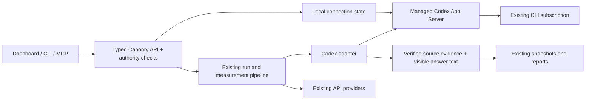

# Handoff: Codex subscription provider

## Current state

Implemented on branch **`feat/codex-subscription-provider`**, based on `origin/main` at `ce28687c960cb27f6e173cc56510b33b44a0f0b3`. Canonry and plugin manifests are bumped to **5.29.0**. No production deployment, global Canonry installation, PR merge, or Codex logout was performed.

The implementation adds a separate local `codex` answer-engine provider alongside existing API providers. It reuses the hosting OS user's CLI subscription authentication. It is disabled until connected and excluded from implicit provider selection even after connection.



PR: [chacha-labs/ayyeo#1](https://github.com/chacha-labs/ayyeo/pull/1), against `main`. Actions remains disabled as requested; local verification is recorded under `checks/pr-preparation/`. No merge or deployment has been performed.

## Use this build

Install workspace dependencies and build/start the modified Canonry server using the normal development workflow. The globally installed `cnry` binary or an already-running older server does not automatically acquire these routes.

On the machine hosting Canonry:

```sh
codex login
cnry settings codex connect --format json
cnry settings codex status --format json
cnry settings codex refresh --format json
cnry run <project> --provider codex --probe --wait --format json
cnry settings codex disconnect --format json
```

Use `connect --model <id>` to choose a discovered model. The first connect pins the runtime default; subsequent connects preserve the pin unless explicitly changed. Disconnect disables Canonry, closes its subprocess, and leaves the CLI signed in. Select Codex explicitly in project engine settings, a run, or an Advanced plan. Do not remove `--probe` for verification unless the results are intended to affect ordinary analytics.

Local and hosted access are intentionally different: `packages/canonry` supplies the execution callbacks; `apps/api` reports Codex unavailable and refuses connection changes. All connection operations require instance-administrator authority, including CLI and MCP calls. No endpoint accepts credentials, executable paths, or a custom Codex API URL.

## Implementation map

- `packages/provider-codex/`: App Server JSON-RPC process/lifecycle, subscription identity checks, isolated ephemeral conversations, bounded execution, cancellation, verbatim-web-program AST guard, and source normalization. `generateText` respects requested output formats without claiming a visibility observation.
- `packages/canonry/src/codex-connection.ts`: non-secret configuration, connect/refresh/disconnect, pinned model, account fingerprint, and registry enrollment. The server supplies it to `packages/api-routes/src/codex.ts`.
- Contracts, OpenAPI, generated client, CLI, and MCP expose the same status/connect/refresh/disconnect capabilities. Setup and Settings use `CodexConnectionForm`; existing API-key forms remain available.
- `isImplicitProvider` keeps Codex out of default selection in run admission, execution, one-shot snapshots, and onboarding readiness. Existing provider defaults continue to behave as before.
- `readMarkdownAnswer` separates visible text from hidden Markdown destinations. Codex retains original Markdown in raw evidence while using rendered text for mention matching. Shared mention/citation classifiers remain authoritative.
- The new retrieval contract is `codex-web-search-v1`. Requested model identity is saved; `servedModel` is not fabricated from it. Original web output and source mappings are retained. Final builds also retain the accepted tool programs.

Public routes, under the configured base path:

| Method | Route | CLI | MCP |
|---|---|---|---|
| GET | `/api/v1/settings/providers/codex/status` | `settings codex status` | `canonry_codex_status` |
| POST | `/api/v1/settings/providers/codex/connect` | `settings codex connect` | `canonry_codex_connect` |
| POST | `/api/v1/settings/providers/codex/refresh` | `settings codex refresh` | `canonry_codex_refresh` |
| POST | `/api/v1/settings/providers/codex/disconnect` | `settings codex disconnect` | `canonry_codex_disconnect` |

## Verification and live evaluation

See [the evaluation overview](README.md), [machine-readable results](after/evaluation.json), and [artifact inventory](artifact-inventory.json).

- Before: 20 Gemini + 20 Claude answers, full saved results and sanitized raw responses.
- After: 20 Gemini + 20 Claude + 60 requested Codex answers. All API calls produced observations; Codex saved 58/60 (96.7%), above the 95% acceptance threshold.
- Codex pass 1 rejected **“Enact Systems vs Solo for solar proposals”**; pass 2 rejected **“Aurora Solar vs EnergyLink for residential solar.”** Both failed source attribution. There are no fabricated negative snapshots for them. Their discarded raw answer bodies were not persisted.
- All 58 saved Codex answers were reviewed for target mention/citation labels and source relevance/support. No classification mismatches were found. Short-name “Aurora” alone is not the configured full “Aurora Solar” alias; several valid cited-only cases demonstrate the distinction.
- Offline replay of the portable published corpus checks **139 observations**: 40 before, 98 after, and one final smoke result. It reproduces the saved fields with zero mismatches and makes no network calls.
- The final AST guard was added after the three-pass benchmark. It accepts all 16 real pilot programs and rejects synthesized/transformed tool output. A separate live compiled-server smoke query exercised the hardened path successfully; disconnect left the CLI subscription authenticated. Do not claim that the entire 60-query benchmark ran after this last hardening.
- Focused tests cover provider normalization/protocol/process failures, timeout/cancellation, identity changes, actual authenticated API/CLI/MCP calls and base paths, denied narrow/viewer access, Simple default exclusion, Advanced scope/model/location retention, probe exclusion, and UI behavior. Current test summaries are in `checks/validation-summary.json`.
- CLI and web builds, affected typechecks, `pnpm check`, generated-client drift, and plugin drift were checked locally. Existing OpenAPI comment and web bundle-size warnings are retained. Full workspace CI is separate; Actions remains disabled on this fork at the operator’s request.
- The original handoff lacked a signed-in browser walkthrough. This was completed during PR preparation; see the update below.

## September 28 failure investigation

Both originally rejected queries were rerun three times each with pre-validation diagnostic capture; all six new attempts passed. See [the investigation and retained answers](failure-rerun-2026-09-28/README.md). The original causes remain unprovable because their answer bodies were not retained; the later full-basket run reproduced and fixed a native-redirect failure on the same Enact/Solo query. At capture time, the installed runtime was 0.158.0 and the production guard still allowed only 0.157.1, so these were explicitly separate diagnostic-pilot calls. The PR preparation below subsequently added evaluated 0.158.0 support. The original 58/60 benchmark is unchanged. See the PR preparation update below for the subsequent fixes and validation.

## PR preparation (September 28)

- Rechecked npm before push: both published packages are 5.28.1, so the feature release is bumped to 5.29.0. The original captures retain their historical 5.21.0 build identity.
- Added evaluated 0.158.0 compatibility, two captured replay fixtures, and supported/unsupported-version tests. Unknown runtime versions still fail closed.
- Failed measurement turns now retain allowlisted final-answer/web evidence in owner-only gzip JSON files under the local config directory's `diagnostics/codex/`. Retention is bounded to 100 captures / 100 MiB. Storage failure never masks the original provider failure. These are host-only files, not observations or public API payloads.
- Completed a signed-in dashboard walkthrough: Settings connect, refresh, disconnect, setup connect, explicit project engine enrollment, and recognition of configured readiness. Fixed duplicate refresh buttons and the misleading disconnected label when Codex was connected but not selected. Captured screenshots remain in `.context/`.
- Replayed the unchanged 139-observation corpus with zero mismatches; 328 focused regression tests passed, including the new failure-storage and setup cases. The first final-build attempt reproduced an Enact/Solo attribution failure: the adapter ignored native redirect metadata. See [the retained evidence and fix](redirect-investigation-2026-09-28/README.md). The interrupted attempt is not counted as acceptance. The [fresh acceptance run](final-acceptance/README.md) completed 59/60 (98.3%), with zero replay or reviewed extraction mismatches. All 60 final answers, including one rejected for unverified source evidence, were retained and reviewed. A separate final-build smoke passed after the diagnostic/identity refinements.

- Current complete archive replay covers **199 observations**, with zero mismatches. The 328-test focused suite, affected typechecks, CLI/web builds, `pnpm check`, and generated-client/plugin/skill drift checks passed. Full-workspace CI was not run.

## Important limits for the next engineer

1. **Experimental protocol dependency.** Supported App Server runtimes are `0.157.1` and `0.158.0`. The launcher reported `0.144.5`, so the integration reads runtime identity from initialization. Do not loosen the version guard without new protocol/evidence fixtures and a bounded live pilot.
2. **Evidence can be unavailable.** Public search events alone are insufficient. Missing raw evidence, transformed tool output, unresolved citations, or unsupported formatting fail closed. Improve supported formats with real fixtures; never weaken the source requirement to improve completion numbers.
3. **Account identity visibility.** Canonry fingerprints email plus workspace account ID when the runtime discloses it (verified on 0.158.0). Older responses without workspace identity fall back to email, so same-email workspace changes cannot be detected there. Upgrading from an email-only pin requires reconnecting.
4. **Shared CLI context.** Repository instructions, skills, plugins, MCP tools, shell, and image tools are disabled. Codex can still list its global CLI `AGENTS.md`; this is documented, and it can be relevant when comparing different operator environments.
5. **Measurement scope.** Live acceptance used Simple portfolios. Advanced behavior is covered by automated execution tests. The dataset is one software category and one domain, not a broad answer-quality benchmark or a measurement of consumer ChatGPT behavior.
6. **Review meaning.** Source review is assistant review of captured evidence, not an external human audit or exhaustive fact-check of vendor claims. Many rankings are explicitly qualified model judgments. Live answer variation is not itself a software regression.
7. **Provider limits.** One query at a time, six logical queries/minute, 100/day by default, three-minute turn deadline. Subscription allowance is shared with other Codex activity. There is no API-key fallback or automatic purchase of credits.

## Reproduce and continue

```sh
pnpm install --frozen-lockfile
node --import tsx scripts/replay-codex-evaluation.mjs
pnpm exec vitest run --project provider-codex
pnpm exec vitest run --project canonry codex-connection.test.ts codex-surfaces.test.ts
pnpm exec vitest run --project web codex-connection.test.tsx
pnpm check
```

For another live evaluation, use a fresh isolated config/database, the exact `before/manifest.json` query basket and API model pins, and a separately recorded Codex model. Read credentials from local configuration; never commit them. Keep outcomes for every requested query, including failures, and separate branded/non-brand denominators. Save runtime/build identity and source captures. Historical scripts are included under `context/scripts/` as implementation records, but assume the original `.context` layout.

If changing the request prompt or retrieval policy, introduce a new retrieval contract. If changing source parsing, run the saved corpus replay, adversarial provenance tests, and focused live examples. Keep the existing baseline unchanged and record new captures in a new directory.
